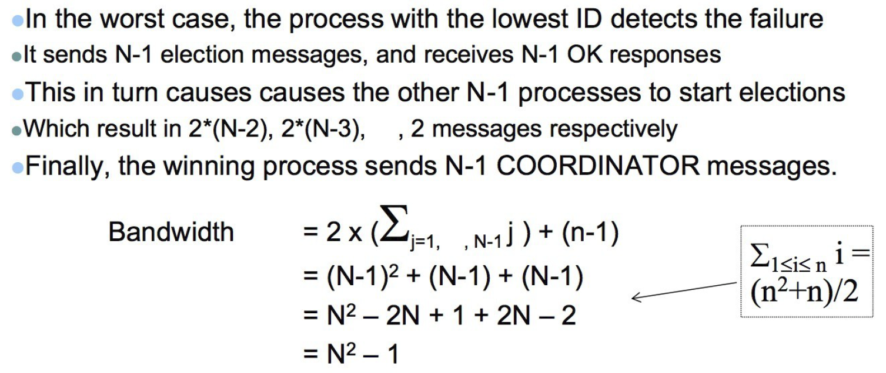

# Election Algorithms
## Goal
Election algorithms choose a process from a group of processors to act as a **coordinator**. If the coordinator process crashes due to some reasons, then a **new** coordinator is elected on other processor. Election algorithm basically determines where a new copy of the coordinator should be **restarted**.
## Two Algorithms
* Ring Algorithms
* Bully Algorithms
## Measurement of performance
* total network bandwidth utilization
* turnaround time for the algorithm

# Ring Algorithms
This algorithm applies to systems organized as a ring(logically or physically). In this algorithm we assume that the link between the process are unidirectional and every process can message to the process on its right only. Data structure that this algorithm uses is active list, a list that has a priority number of all active processes in the system. 
## Bandwidth
* Worst case scenario, N-1 messages are required for the ultimate winner to **receive the elect message**.
* A further N messages are required for the elect message to come back around so **the winner knows it has won**.
* A further N messages are used to **inform everybody of the result** (the elected message).

Therefore the bandwidth is **(N –1) + N + N = 3N – 1**
## Turnaround Time
Each node transmits each message in sequence. Therefore the turnaround time is the also **3N – 1**

# Bully Algorithms
## Bandwidth

In the best case, the process with the second-highest identifier notices the failure of the existing co-ordinator, so it can immediately elect itself and send N-2 co-ordinator messages.
## Turnaround Time
* Worst case N - 1 elections held giving a turnaround time of N - 1
* Best case Turnaround time is just 1 message, as these are sent concurrently.