# 01-Introduction

## Definition

This course adopts the view of a Distributed System as:

- A collection of independent computers that appear to the users of the system as a single computer.

 Or, more specifically:

- Any system that consists of hardware or software components located at networked computers that communicate and coordinate their actions via message passing.

## Why Use Distributed Systems?

Distributed System is often to connect **users** and **resources** in a *transparent*, *open*, and *scalable* way.

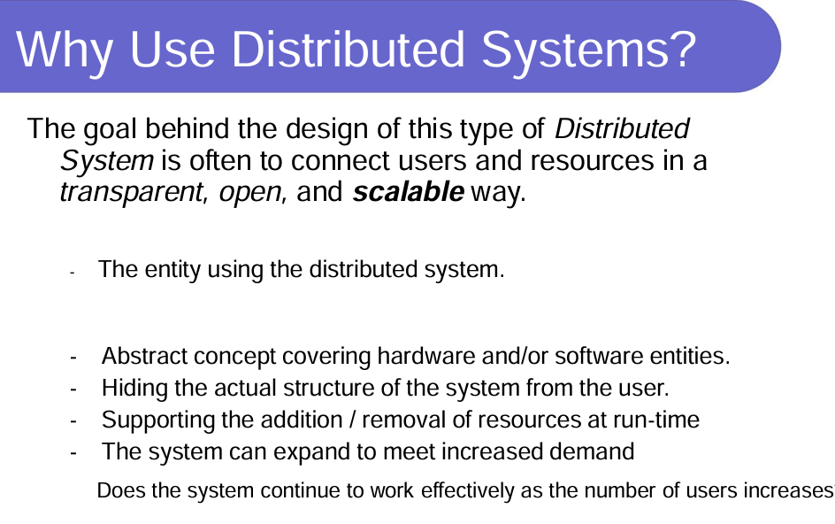

## Terminology:

### Host, Site, Server, Client?

- A **Site** is a geographical location that contains one or more hosts in the DS (Distributed System).

- A **Host** (also known as a node or a machine) is a specific machine that is connected into the distributed system.

***Hosts can be clients and/or servers:*** 

- A **Server** makes resources available to the DS. 
- A **Client** accesses the servers and utilizes any available resources.

### Resource, Task

- A **Resource** is a program or data that resides on a host

- A **Task** (also known as a computation or job) is a specific set of instructions that a user asks the distributed system to execute.

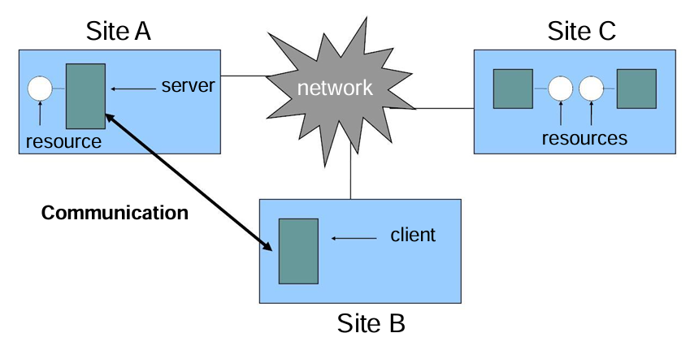

## Benefits, Issues and Challenges

### Resource Sharing

Benefits:

- We can directly access resources that we would otherwise not  be able to.
- We can share our own resources with our friends / colleagues.

 Issues:

- How do we control access to the resource?
- What happens if a resource becomes unavailable?

### Concurrency

**Def**: Multiple machines allows multiple users to work in parallel.

***This means the system must be able to handle multiple tasks concurrently.***

Benefits: 

- Computational Speedup – the system can exploit parallelism to reduce  the time taken to complete a task. 

Issues: 

- Too many users trying to do the same thing can lead to resources becoming  overloaded, thus increasing the time taken to complete the task. 
- Concurrency has costs in terms of task management, network communication  overheads, … 
- How can we ensure that (possibly conflicting) operations are performed  correctly?

### Global Time

Examples:

- 在银行系统中，必须使用单个全局时钟记录所有事务，以确保这些事务以正确的顺序应用于客户帐户。

Issues:

- A Distributed System has, by default, no global clock, therefore any solution  requiring a global clock must include an appropriate implementation.

 ### Reliability-Redundancy

**Reliability is often related to the level of redundancy in the system.**

- **In theory:** A Distributed System is more reliable than a single-processor system due to replication of resources, and distribution of work load.
- **In practice:** This is not always the case

# 02-Architectures

## Core System Architectures

### Client-Server:

- 客户端进程与不同计算机上的单个 Server 进程交互，以便访问它们管理的共享资源。

- Servers 本身可能是其他服务器的客户端。

Example: **The World Wide Web**

### Peer-to-Peer (P2P):

- 任务或活动中涉及的所有进程都扮演着类似的角色，作为对等节点协作交互，客户端和服务器进程或运行该任务的计算机之间没有任何区别。

Example: **Gnutella File Sharing Service**

## Distributed Concurrency

# 03-Logical Clocks

- Temporal Ordering: the time of occurrence in real-time
  - induces a ‘happens-before’ relation 

- Causal Ordering: cause-effect relationship; implies temporal order

**There is no requirement for   “relative time” to have any relation to the “real time”**

## Lamport’s Logical Clocks

- **First point:** 如果两个进程不交互，那么它们的时钟就不需要同步——它们可以同时运行而不必担心相互干扰

- **Second (critical) point:** 两个进程共享一个关于“真实”当前时间的共同概念并不重要。重要的是，这些进程对某些事件发生的顺序有一定的共识。

Based upon these observations, he devised the **“happens before”** relation (denoted “→”).

## The “Happens-Before” Relation

### Properties of “→”:

- 如果A和B在同一进程，A在B之前发生，则称**A“ happens -before”B**（记作A→ B）
- 如果 A 是发送消息的事件，B 是收到相同消息的事件，则 A →B

- 如果 A → B 且 B → C，则 A → C（**传递性**）
- 如果A和B没有→相关，则它们同时发生（即它们是**concurrent events**）

当A → B，A的时间戳大于B怎么办？

***Lamport的办法是把B的时间戳调整为A+1***

## Vector Time

**Vector clock是一种算法，用于在分布式系统中生成事件的部分排序并检测因果冲突。**

规则：

1. 最初所有 clocks 都为零
2. 每次进程遇到内部事件时，它都会将 vector 中自己的 logical clock 增加 1
3. 每次进程发送消息时，它都会将 vector 中自己的逻辑时钟递增 1，然后发送自己的 vector 的副本
4. 每次进程收到消息时，它都会将向量中自己的逻辑时钟增加 1，并通过取自己的向量时钟中的值和接收到的消息中向量中的最大值（对于每个元素）来更新其向量中的每个元素

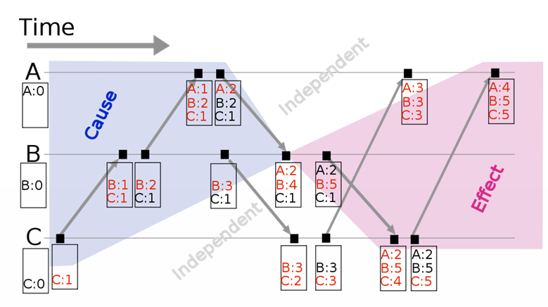

## Global State

我们如何同步此写入活动以同时捕获所有进程的状态？

### Cut

- Events at the process/channel that happen   before the cut (or the time point) are **“in the cut”**

  And happening after the cut are **“out of the cut”**.

### Consistent cut

A cut that obeys causality.

### Snapshot algorithm

## Mutual Exclusion

**It is often necessary to protect a shared resource within a  Distributed System using “mutual exclusion”.**

Three techniques:

1. **Centralized:** a single coordinator controls whether a process can enter a  critical region.
2. **Distributed:** the group confers to determine whether or not it is safe for  a process to enter a critical region.
3. **Token Ring:** processes are organized into a logical loop and use a  token to determine when to enter a critical region.

### Centralized Algorithm

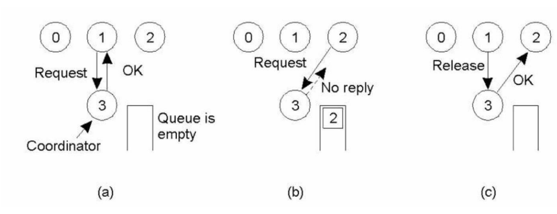

(a) 进程1向coordinator申请进入critical region的许可，coordinator**回复OK**

(b) 进程2向coordinator申请许可，critical region被占用，coordinator**不回复**（不回复代表**busy state**）

(c) 当进程1退出critical region时通知coordinator，coordinator回复进程2**OK**

| **Advantages:**                | **Disadvantages:**                               |
| ------------------------------ | ------------------------------------------------ |
| It works.                      | There’s a single point of failure!               |
| It is fair.                    | The coordinator is a bottleneck on busy systems. |
| There’s no process starvation. |                                                  |
| Easy to implement.             |                                                  |

**Critical Question:** 

- 当coordinator不回复的时候，是“**dead**”还是“**busy**”？

### Distribute Algorithm

1. 节点发送一个请求消息给其他所有节点，附上时间戳。
2. 其他节点收到请求后，如果不在临界区或其请求时间戳较晚，则回复“OK”。
3. 只有在收到所有节点的“OK”后，节点才能进入临界区。
4. 退出临界区时，通知所有等待的节点。

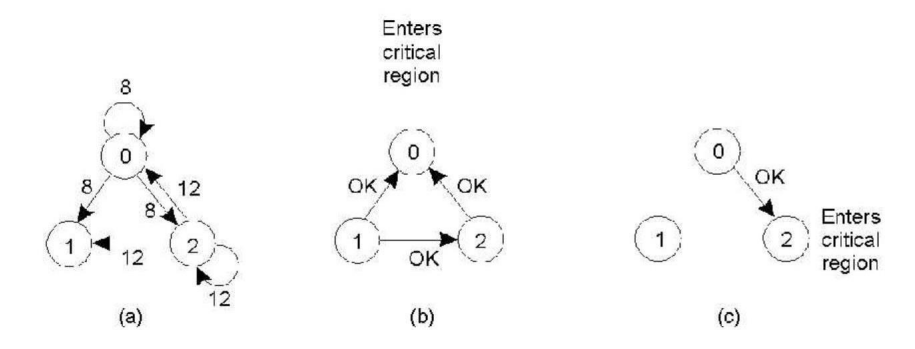

**The algorithm works because in the case of a conflict, the  lowest timestamp wins as everyone agrees on the total  ordering of the events in the distributed system.**

| Advantages                          | Disadvantages                                                |
| ----------------------------------- | ------------------------------------------------------------ |
| It works                            | We now have multiple points of failure!!!                    |
| There is no single point of failure | A “crash” is interpreted as a denial of entry to a critical region. |
|                                     | (A patch to the algorithm requires all messages to be ACKed) |

**Worse still:**

- All processes must maintain **a list of the current processes** in the group (and this can be tricky)

- One overworked process in the system can become a **bottleneck** to the entire system – so, everyone  slows down

### Token-Ring Algorithm

1. When the ring is initialized, process 0 is given a token.
2. The token circulates around the ring.
3. It is passed from process k to process k+1.
4. When a process acquires the token from its neighbor it  checks to see if it is attempting to enter a critical region.
5. If so, the process enters the region, does all the work it  needs to and leaves the region.
6. Token is passed to the next process in the ring

| Advantages                                                   | Disadvantages                                                |
| ------------------------------------------------------------ | ------------------------------------------------------------ |
| It works (as there’s only one token, so mutual exclusion is guaranteed) | Lost token! How is the loss detected (it is in use or is it lost)? How is the  token regenerated? |
| It’s fair – everyone gets a shot at grabbing the token at some stage | Process failure can cause problems – a broken ring!          |
|                                                              | Every process is required to maintain the current logical ring in memory – not easy |

### Comparison: Mutual Exclusion

# 04-Election Algorithms

一些分布式系统要求其中一个进程发挥特定的作用。例如，选择一个进程在**Centralized Mutual Exclusion**算法的变体中扮演 “**central-server**” 的角色。在这种情况下，我们需要采用一种机制来选择“**Leader**" 进程。

该机制必须：

1. 必须允许所有相关进程参与选择
2. 必须产生一个被所有过程接受的单一选择。
3. 一旦被选中，“**Leader**”将执行分配的角色，直到他们“退休”或失败

我们将这种机制称为 **Election Algorithm**。

In this course we will consider two algorithms：

- The Ring Algorithm
- The Bully Algorithm

## Ring Algorithm

> Elect a single process, known as the **coordinator**, which is the process with the **largest ID**.

### Impl:

- Processes 组织在一个**logical ring**里面
- 每个进程**从左侧的邻居接收**消息，并**向右侧的邻居发送**消息。

- 每个进程都存储一个本地“**active list**”，其中包含系统中每个活动进程的进程 ID
- 当进程在list中看到自己的ID（完成一个循环），消息类型变为**coordinator**
- 循环继续，选择ID最大的进程作为**coordinator**

### **Analysis:**

**Bandwidth:**

- 在最坏的情况下，最终获胜者需要**N-1**条消息才能收到选中的消息。

- 需要另外的**N**个消息才能让选中的消息返回，这样赢家就知道自己赢了
- 另外还有**N**个消息用于通知每个人结果（当选消息）

Therefore the bandwidth is **(N –1) + N + N = 3N – 1**

**Turnaround Time:**

每个节点按顺序传输每个消息

Therefore the turnaround time is the also **3N – 1**

## Bully Algorithm

### Impl:

1. 如果 P 具有最高的进程 ID，则它会向所有其他进程发送 Victory 消息并成为新的 Coordinator。否则，P 将向进程 ID 高于自身的所有其他进程广播 Election 消息。

2. 如果 P 在发送 Election 消息后没有收到 Answer，则它会向所有其他进程广播 Victory 消息并成为 Coordinator。
3. 如果 P 从具有更高 ID 的进程收到 Answer，则它不会为此次选举发送更多消息，并等待 Victory 消息。
4. 如果 P 从另一个 ID 较低的进程收到 Election 消息，则会发回 Answer 消息，并通过向编号较高的进程发送 Election 消息，在开始时启动选举进程。
5. 如果 P 收到 Coordinator 消息，它会将发送者视为 Coordinator。

| 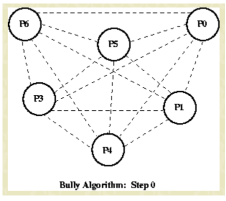 | 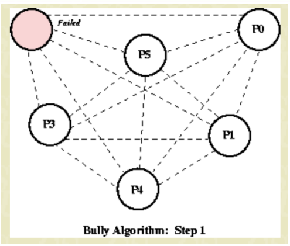 | 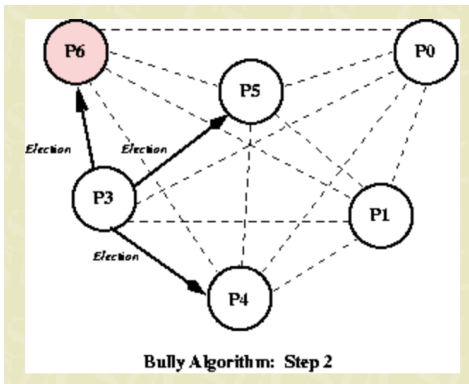 | 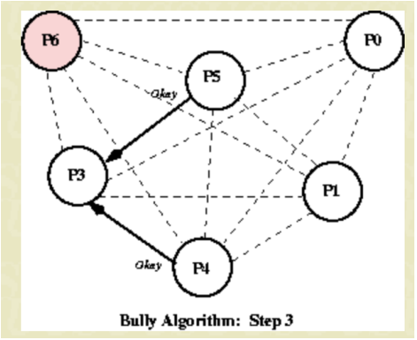 |
| ------------------------------------------------------------ | ------------------------------------------------------------ | ------------------------------------------------------------ | ------------------------------------------------------------ |
| 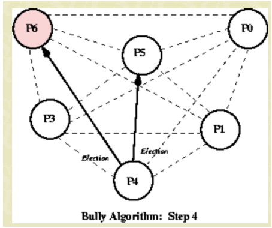 | 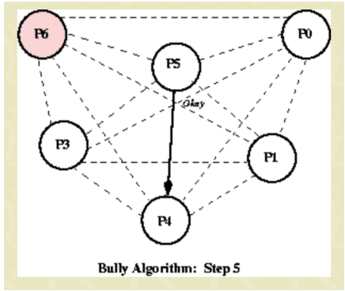 | 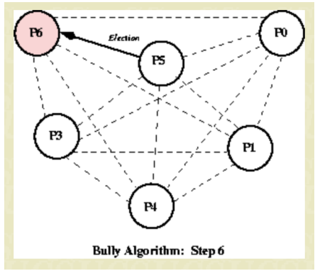 | 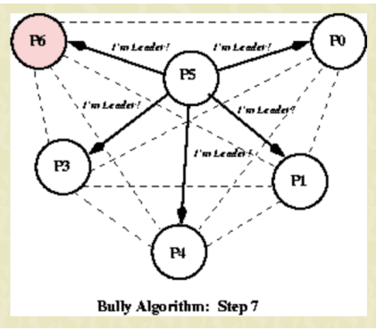 |

### **Analysis:**

|                 | Worst | Best         |
| --------------- | ----- | ------------ |
| Bandwidth       | N²-1  | N-2          |
| Turnaround Time | N-1   | Concurrently |

## Distributed File Systems (DFS)

A Distributed File System aims to make remote files accessible to a local user.

### Components

#### File Servers:

- 软件硬件结合
- 硬件包含secondary storage resources (e.g. magnetic disks)

- 软件处理file service request

#### Clients:

- 将file service request传输到文件服务器
- 包括服务的用户界面

#### File Services:

- 指定 DFS 的原始文件操作
- 例如：创建文件、删除文件、从文件中读取...

### Transparency

**Location transparency**

- 文件名不显示文件的物理存储位置

**Location independence**

- 当文件的物理存储位置发生变化时文件名不需要更改

### Remote File

|               | Upload/Download Model                                        | Remote Access                                                |
| ------------- | ------------------------------------------------------------ | ------------------------------------------------------------ |
| IDEA          | Move the file to the file system                             | Remotely Control the File System                             |
| Advantages    | Simple file service interface                                | 1. Not requiring much space on the clients;          2. Eliminates the need to pull in entire files when only small pieces are needed |
| Disadvantages | 1. Enough storage must be available on the client;  2. Moving the whole file is sometimes wasteful! | Accessing the same data repeatedly (caching can deal with this) |
| Graph         |  | 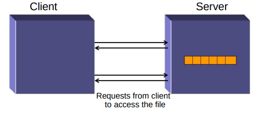 |

#  06-Distributed File Systems

## Stateful vs Stateless

### Stateful

> The File Server keeps a copy of a requested file in memory until the client has finished with it.

**When Client opens a file:**

- Server fetches information about the file from its disk
- Stores it in its memory
- And gives the client a connection identifier unique to the client and the open file

Identifier 用于后续访问，直到会话结束

服务器必须回收不再处于活动状态的客户端使用的主内存空间。

**Advantage:**

- Increased performance by **fewer disk accesses**.
- Stateful server knows if a file was opened for sequential access and can **thus read ahead the next blocks**.

### Stateless

> The File Server treats each request for a file as self- contained. 每个请求都是独立的

- 每个请求都必须标识要访问的文件名和要访问的数据（在文件中）的位置。
- 此方法消除了通过打开和关闭操作建立和终止连接的需要
- Reads and writes take place as **remote messages** (or cache lookups)

**Disadvantage：**

- longer request messages 
- slower request processing

### Failure Recovery

| Stateful                                          | Stateless                                                    |
| ------------------------------------------------- | ------------------------------------------------------------ |
| A stateful server **loses all state** in a crash. | The effects of server failures and recovery are almost unnoticeable. |

## File Replication

- 单个逻辑文件的多个物理副本
- 命名服务维护对每个副本

### Replication transparency

The existence of the copies is hidden from the user. (对用户隐藏副本的存在)

### Why Replicate?

- **Performance Enhancement:** 访问文件的请求可以分散到多个文件服务器上，也可以从 "最近的服务器 "检索
- **Increased Availability:** 在发生以下情况时仍可访问文件服务器故障或通信中断时仍可访问文件

## Security

**Security is key to DFS:** 

- It controls access to the data stored in the files
- It deals with authentication of client requests.
